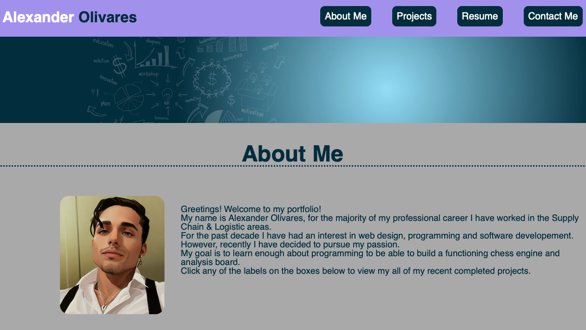
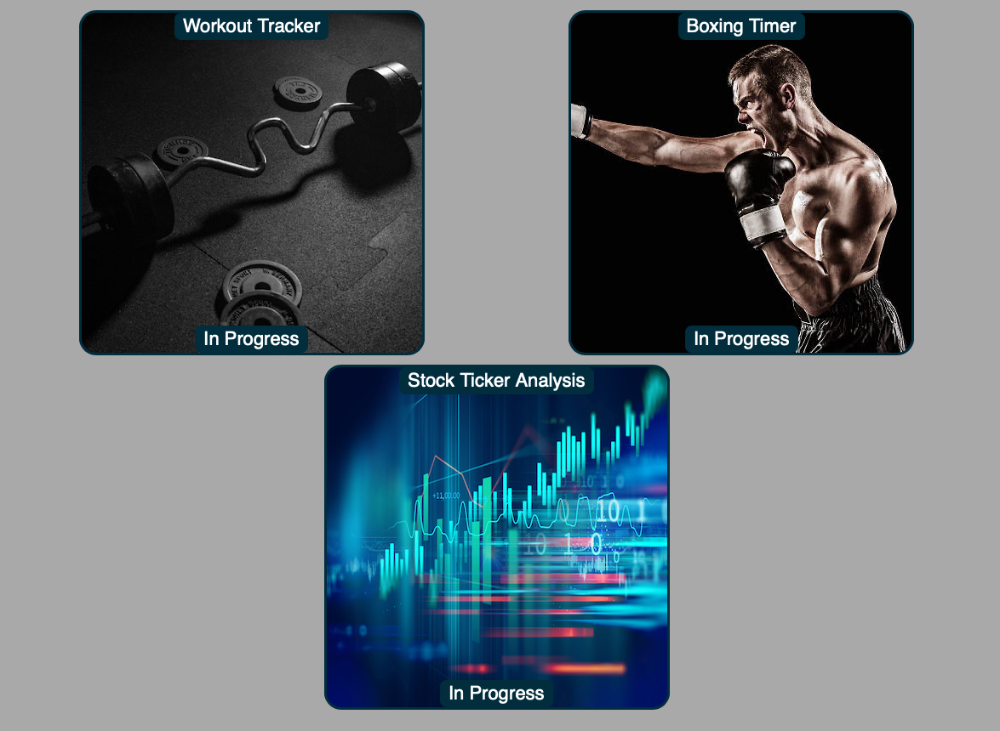
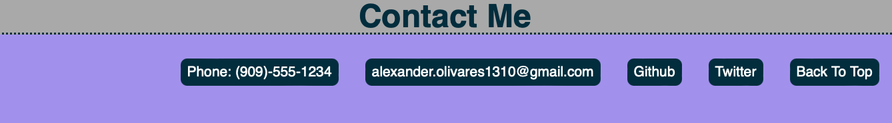

# Agile-Developements

## Description

- This project was created to serve as an online portfolio to host my various projects I will be working on throughout my growth as a full stack developer, and even after as I continue to improve. I built this project to help me apply the concepts that I've learned throughout my first few weeks in my bootcamp, and I was able further to challenge myself by taking on this project and learning to problem solve any issues that surfaced alone the way. By the end I learned much more about flexbox and how to properly apply the properties within the code to make it responsive and match the vision that I had in mind.

## Table of Contents

- [Installation](#installation)
- [Usage](#usage)
- [Credits](#credits)
- [License](#license)

## Installation

N/A

## Usage

- Navigate to [https://alexanderolivares13.github.io/Agile-Developements/](https://alexanderolivares13.github.io/Agile-Developements/)

- Website:

- Click any of the buttons on the header to be taken to those respective sections, or taken to the website that hosts my public resume. Hover over them to see that they highlight over your current selection.

- Looking at the diffent cards on the porftolio, hover over the boxes and labels to see them highlight and be responsive for focus. Click on any of the labels at the top of the boxes to be taken to the respective website or app of each project (they are currently all placeholders, so clicking on them will just take you to google).

- The buttons on the footer are fully functional, click on the phone number to immediately open your dialer, click on the email address to send an email, and go to the respective websites and sections.

## Credits
- Lines of code 15-41 (HTML) Lines 15-39 (CSS) code is similar in structure and use as the code from Challenge 01 for the nav bar strucute. By using ul/li to place the anchors into and float to the right side of the page. 

- Thank you to the following websites for the stock images used for my profile. All credits go to the respective sites for the images.

- The AI generated image of myself is thanks to [https://imgcreator.zmo.ai](https://imgcreator.zmo.ai)
- The banner under the header of my page is thanks to [https://pngtree.com](https://pngtree.com)
- The chess board for my main card is thanks to [https://www.pexels.com](https://www.pexels.com)
- The weights stock photo is from [htthps://isorepublic.com](htthps://isorepublic.com)
- The boxer stock photo is from [https://istockphoto.com](https://istockphoto.com)
- The stock, stocks candlestick photo is from [https://qs.com](https://qs.com)

- Thank you to my tutor (Ben, Martin) for helping me understand flex properties better and a anchors to make the images in my boxes repsonsive and clickable links.

## License

- Please refer to the license in the repo.
